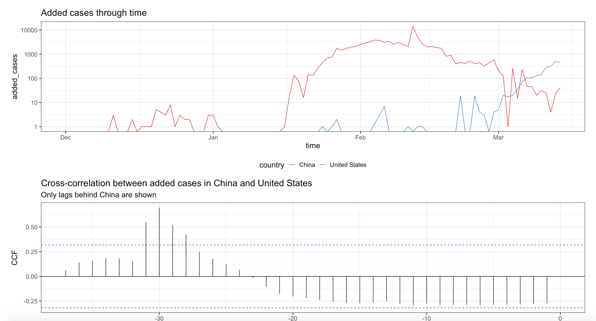

# COVID-19 confirmed case visualisation

# Instructions


The main app visualises the cumulative/added confirmed cases of a selected country and compare that against China. There is an additional plot cross-correlation of added cases between China and the selected country. 

The main idea is to understand how many days of lags exist between China's rapid increases and the selected country. 

E.g. Based on the plots below (15th March 2020), it seems like USA lags behind China roughly 30-45 days. 



```
library(tidyverse)
library(shiny)
library(forecast)
library(ggrepel)
library(nCov2019)
## devtools::install_github("GuangchuangYu/nCov2019")

shiny::runGitHub(
    repo = "covid19", 
    username = "kevinwang09", 
    ref = "master")
```

# Motivations

I am currently in the USA looking at the speed of this outbreak. The daily news keeps getting worse except those from China (as of 15th March 2020) who reported a basic containment. I thought the best way to keep myself informed is to look at the data and do the analysis myself. I would like to use China as a point of reference to understand how the outbreak differs betwen different countries (if at all).

I am writing materials for a lecture in Shiny apps, so any suggestions are welcomed. 


# Acknowledgement

+ I thank GuangchuangYu for developing the `nCov2019` which facilitates the daily downloads of the data.
